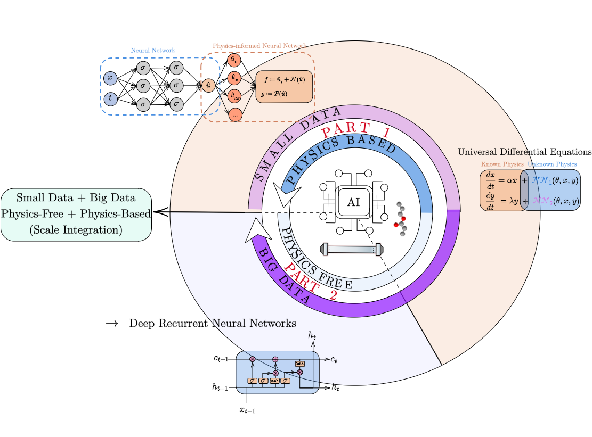

I am a passionate researcher and innovator currently engaged as a postdoctoral researcher at NTNU in Norway. My academic journey has taken me through a master's in chemical engineering from the University of Porto, another in industrial engineering from the Federal University of Bahia, and culminated in a Ph.D. from the University of Porto, where I specialized in data science applied to digital transformation (Industrial AI) within the prestigious MIT Portugal program.

My research and professional interests lie in Data Science, (Scientific) Machine Learning, and Process Engineering, particularly as they apply to Industrial Engineering challenges such as blue hydrogen production and oil and gas production. I am driven by a deep curiosity to harness the power of AI and data science to push the boundaries of Process Systems Engineering.

### Skills and Achievements

- **Author of 20+ Papers:** Published in top-tier Q1/Q2 journals, focusing on AI and Process Systems Engineering.
- **Python Expertise:** 6 years of experience in developing robust Python solutions.
- **Julia Programming:** 3 years of crafting solutions in Julia for cutting-edge applications.
- **Process Systems Engineering (PSE):** 7 years of advancing PSE solutions with a focus on industrial applications.

I am committed to driving innovation in the industrial sector through the integration of AI, data science, and engineering principles. Let's connect and explore how we can shape the future of industrial processes together!

  
